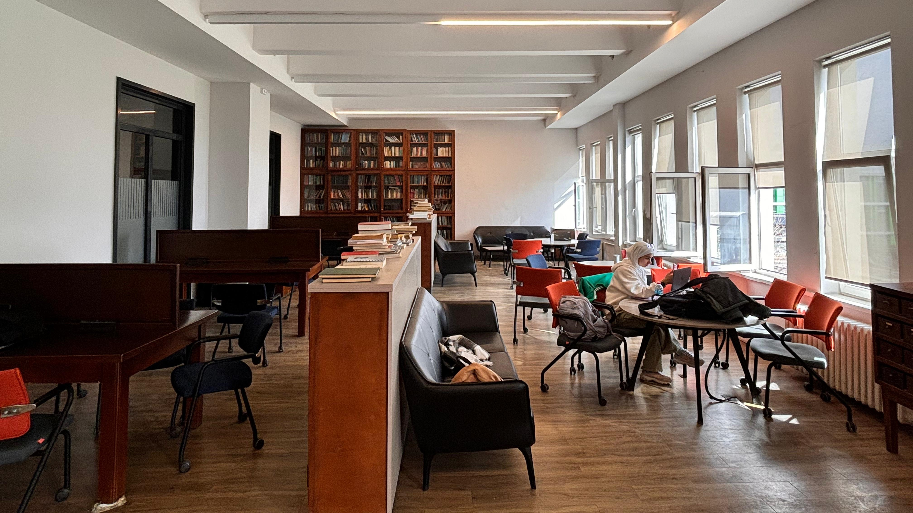

# Helping

I initially wanted to call this ***Helping Others***.

But decided not to.

Because when you’re able to help others, you’re also helping yourself.

> Is what you receive back proportional to what you deliver?  
> **The answer might be yes. That’s a terrifying idea.**  
> — Jordan Peterson, [19 August 2022](https://youtu.be/sY8aFSY2zv4?t=10705)

---

Back in 2018, I was working tirelessly on the courses I had taken at [ITU](https://www.itu.edu.tr/en/homepage). One of them was about [control systems](https://kontrol.itu.edu.tr/docs/librariesprovider23/ders-kataloglari/kon317e.pdf?sfvrsn=2c0ed346_2).

The material wasn’t the hardest on paper, but to truly understand what was expected, you needed a working intuition—how to analyze and construct control systems from scratch.

I was quite a novice at resource management (attention, time, and money) back then.

I knew there was a book that could help a lot. But it wasn’t cheap.

And the few copies in the library were always checked out.

One evening, I found myself wandering through our faculty’s quiet study hall—curious, tired, and looking for some kind of help.

And there it was. ✨

The exact book I had been searching for, tucked away on the top shelf.

It had clearly belonged to a graduate student.

Inside were not just the contents of the course—but their own notes, questions, and highlights.

It felt like a small miracle.

A secret hand reaching out from the past to help me.

I’ve **never** forgotten the gratitude I felt in that moment.

After finals, I returned the book to where I found it. But I never let go of the story.

---

Two weeks ago (May 2025), I finally acted on a long-standing idea—to pay that gratitude forward.

I gathered all the handwritten course notes I had kept from my undergraduate years.

Course by course, organized into bags covered with teddy bears and hearts.

All my midterm notes, final prep sheets, summaries. Almost everything I had built as a student.

And I knew exactly where to place them.

The big magazine shelf at the entrance of our building.

I cleaned the dust, removed outdated materials, and arranged the notes to be as eye-catching—and inviting—as possible.

I left this note:

> Feel free to use these as you wish.  
> If you find them valuable, please consider sharing them with others too.

---

This is a reminder for anyone who wants to live a good life—myself included.

The world needs kindness. And kindness leads to more of it.

All you need to do is find *your* way of being kind.

---

Back to [home page](https://www.kantarcise.com/).